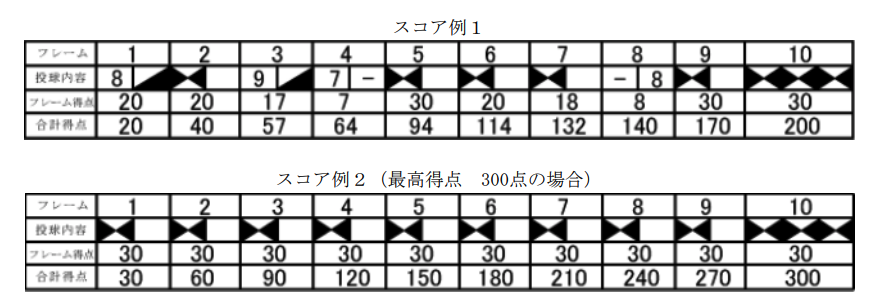

# ボウリングのスコア計算

難易度：★★

## 問題

クラスのレクリエーションとしてボウリングを行うことになりました。参加者ごとの投球情報を入力とし、得点の高い順に成績情報を出力し終了するプログラムを作成してください。なお、同点の場合は学籍番号の若い順に出力してください。ただし参加者は3名以上40名以下とし、1人当たり1ゲームずつ投球しているものとします。

ボウリングとはご存じのとおり、プレイヤーに対して頂点を向けて正三角形に並べられた、10本のピンをめがけてボールを転がし、ピンを倒すスポーツです。 1回目の投球ですべて転倒した場合をストライクと言い、その投球のみで次のフレームに進みます。ストライクでない場合は、残ったピンをそのままにして2回目の投球を行います。
2回目の投球ですべて転倒した場合をスペアと言います。2回目の投球終了後、次のフレームに進みます。
1ゲームは10のフレームから構成され、第1〜9の各フレームは2回投球できます。各フレームの開始時点では、10本のピンがすべて立った状態で用意されます。第10フレームは、ストライクもしくはスペアが出た場合には計3回の投球を、それ以外の場合は2回の投球を行い、ゲーム終了となります。 



スコア計算の方法

- 各フレームにおいてスペア、ストライクがない場合は、2回の投球で倒したピンの本数がそのフレームの得点となります。（スコア例1の第4フレームと第8フレーム）
- スペアを出した場合、倒した本数である10点に加え、次の投球で倒したピンの本数がこのフレームの得点に加算されます。（スコア例１の第1フレームと第2フレームの関係など）  
スコア例１の第1フレームでは第2フレームの1投で倒した10本（点）を加えた20点が得点となります。第3フレームも同様の計算方法です。
- ストライクを出した場合、倒した本数である10点に加え、続く2回の投球で倒したピンの本数が加算されます。（スコア例１の第2フレームと第3フレームの関係など）もちろん続く2投中にストライクの場合があります。（スコア例１の第5フレームと第6、7フレームの関係など）
- 第10フレームのみ、スペア、ストライクを出した場合、3投して倒したピンの総数が第10フレームの得点として加算されます。各フレームの得点の合計が1ゲームの得点となり、最高得点は300点となります。 

### 入力

複数のデータセットの並びが入力として与えられます。入力の終わりはゼロひとつの行で示されます。  
各データセットは以下のとおりです。 

1行目 参加者数ｍ（3以上40以下の整数）  
2行目 1人目の参加者情報  
3行目 2人目の参加者情報  
 ：  
m+1行目 m人目の参加者情報  

参加者情報は１行ずつ次の形式で与えられます。  

学籍番号 第1投の転倒ピン数 第2投の転倒ピン数‥‥ 第n投の転倒ピン数（整数 整数 整数‥‥
整数；半角空白区切り）  

学籍番号は0以上9999以下の整数、転倒ピン数は0以上10以下の整数、総投球数nは、12以上21以下の整数で、得点計算に必要なピン数が過不足なく与えられるものとします。 

### 出力
入力データセットごとに得点の高い順（同点の場合は学籍番号の若い順）に次の形式で出力します。

1行目 成績情報（学籍番号 得点）（整数 整数；半角空白区切り）  
2行目 成績情報（学籍番号 得点）（整数 整数；半角空白区切り）  
：  
ｍ行目 成績情報（学籍番号 得点）（整数 整数；半角空白区切り）   

### 入力例

```
3
1010 6 3 10 7 1 0 7 9 1 10 6 2 4 3 9 1 9 0
1200 5 3 9 1 7 1 0 0 8 1 10 10 4 3 9 1 8 2 9
1101 3 3 3 3 3 3 3 3 3 3 3 3 3 3 3 3 3 3 3 3
4
3321 8 2 10 9 1 7 0 10 10 10 0 8 10 10 10 10
3332 5 0 10 9 1 4 1 9 0 10 10 7 1 5 2 8 1
3335 10 10 10 10 10 10 10 10 10 10 10 10
3340 8 2 7 3 6 4 8 2 8 2 9 1 7 3 6 4 8 2 9 1 7
0 
```

### 出力例

```
1200 127
1010 123
1101 60
3335 300
3321 200
3340 175
3332 122 
```