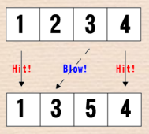

# ヒットアンドブロー

難易度:★★

## 問題
「ヒットアンドブロー」という 2 人用のゲームがあります。ルールは、以下の通りです。
- 出題者と回答者に分かれて行う。
- 出題者は、重複した数を含まない 4 桁の数字（正解）を決める。
- 回答者は、その 4 桁の数字（回答）を言い当てる。
- 回答に対して、出題者はヒットとブローの数でヒントを与える。
- 回答と正解を比べて、数と桁位置の両方が同じであることをヒッ
トと呼び、数だけが同じで桁位置が異なることをブローと呼ぶ。
たとえば、正解が 1234 で、回答が 1354 なら、出題者は「2 ヒッ
ト、1 ブロー」というヒントを与え、正解までこれを繰り返す。
- 出題者と回答者は交代してゲームを行い、より少ない回答で正解を言い当てた方を勝ちとする。
太郎君と花子さんはこのヒットアンドブローで遊ぶこととしました。しかし二人は、ヒットの数とブ
ローの数をその都度判断することが少し面倒に感じているようです。そんな二人のために、あなたはヒ
ットの数とブローの数が即座に分かるプログラムを作成してあげましょう。
正解 r と回答 a を入力とし、ヒットの数とブローの数を出力するプログラムを作成してください。r、a はそれぞれ 0 – 9 の数字 4 つからなる数字の列です。




### 入力
複数のデータセットの並びが入力として与えられます。入力の終わりはゼロふたつの行で示されます。  
各データセットは以下のとおりです。  
1 行目 r a（半角数字列 半角数字列；半角空白区切り）

### 出力

入力データセットごとに、ヒットの数とブローの数を出力します。

### 入力例
```
1234 5678
1234 1354
1234 1234
1230 1023
0123 1234
0 0

```


### 出力例
```
0 0
2 1
4 0
1 3
0 3
