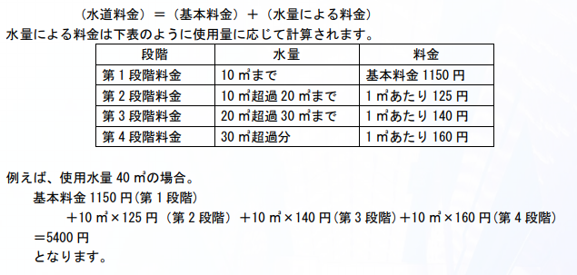

# 水道料金を節約しよう

難易度:★

## 問題
あいづ学園都市に住んでいる松平さんは、普段からエコに気を付けて生活をしています。先月の
水道料金が 4280 円となり、いつも目標としている 4000 円を超えてしまったので、今月は節水に努め
てきました。先月と比べて水道料金はどのくらい節約になったのでしょうか。
今月の使用水量 w(㎥)を入力とし、先月の水道料金である 4280 円と比較して、どのくらい水道料金
を節約できたかを出力するプログラムを作成してください。ただし、w は 0 以上 100 以下の整数としま
す。
なお、水道料金は次のように計算されます



### 入力
複数のデータセットの並びが入力として与えられます。入力の終わりは-1ひとつの行で示されます。  
各データセットは以下のとおりです。  
1 行目 今月の使用水量 w（整数）

### 出力
入力データセットごとに、先月の水道料金との差を出力します。

### 入力例
```
29
40
0
-1
```


### 出力例
```
620 
-1120
3130
```