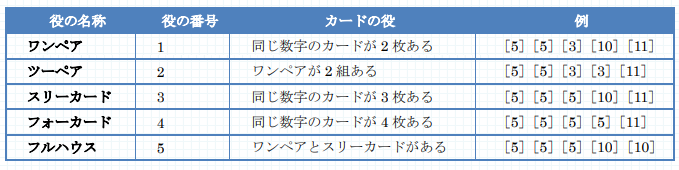

# カードゲーム

難易度:★

## 問題
まさお君は最近カードを使ったゲームにはまっています。このゲームで使うカードには、1 枚にひとつの数字が書かれています。数字は 1 から 13 のいずれかで、それぞれ 4 枚ずつ計 52 枚からなっています。  
1 回のゲームで、各プレーヤーに 5 枚のカードが配られます。配られたカードの組み合わせによって役が決まります。  
役には次の 5 種類があります。



ゲームの数 n 及び各ゲームで配られた 5 枚のカードを入力とし、各ゲームの役の番号の中で最大のものを出力するプログラムを作成してください。ただし n は 1 以上 10000 以下とします。なお、ひとつのゲームで配られたカードが複数の役に該当する場合は、より大きな役の番号をそのゲームの役としてください。  
すべてのゲームでどの役にも該当しない場合は 0 を出力してください。


### 入力

複数のデータセットの並びが入力として与えられます。入力の終わりはゼロひとつの行で示されます。  
各データセットは以下のとおりです。  
1 行目 ゲームの数 n（整数）  
2 行目 第 1 のゲームで配られたカード（整数 整数 整数 整数 整数 ; 半角空白区切り）  
3 行目 第 2 のゲームで配られたカード  
：  
n+1 行目 第 n のゲームで配られたカード

### 出力
入力データセットごとに、最大の役の番号または 0 を出力します。
### 入力例
```
3
5 11 3 5 10
5 5 5 10 10
12 2 8 7 10
2
3 4 10 2 3
1 2 3 4 5
4
8 8 3 2 4
8 9 9 11 11
10 2 10 10 10
13 13 13 13 2
1
2 2 9 3 3
2
9 8 7 6 5
8 7 6 7 7
3
7 8 3 4 10
2 4 12 11 13
12 13 1 2 7
0
```


### 出力例
```
5
1
4
2
3
0
```