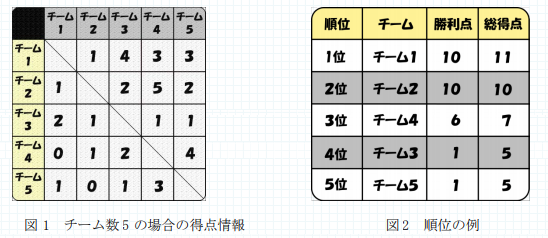

# リーグ戦

難易度:★★

## 問題
会津若松市の鶴賀小学校では、毎年クラス対抗でフットサル大会を行うのが恒例行事となっています。大会は、全クラスが総当たりで一回ずつ対戦するリーグ戦で行われます。しかし、近年、クラス数が増えたため順位の計算が大変です。  
そこであなたは、得点情報を集計し順位を計算するプログラムを作成することになりました。  
得点情報は、対戦相手から奪った得点で構成されます。例えば、参加チーム数が 5 の場合に与えられる得点情報は図１のようになります。




図 1 の表の一行は、各チームの得点情報の例です。例えば、チーム１の行は、チーム 1 がチーム 2、3、4、5 からそれぞれ 1 点、4 点、3 点、3 点を得点したことを意味します。また、図 1 からチーム 1 とチーム 3 の対戦は、4 対 2 でチーム 1 が勝ったことを意味します。
このような得点情報から、以下の方法に従って順位を決定します。
- それぞれの対戦において、得点が多いチームが「勝ち」、少ないチームが「負け」、同じ場合は「引き分け」とする。
- 試合ごとに、各チームの「勝利点」に以下の値が加算される。
  - 勝ったチームは 3
  - 引き分けの場合、両チームに 1
  - 負けたチームは 0
- 最終的に勝利点の高い順に順位が定められる。
- 勝利点が同点の場合、総得点が多いチームを上位とする。
- 勝利点も総得点も同じ場合、チーム番号の小さいチームを上位とする。

図 1 の得点情報の場合、上記のルールに従うと順位は図 2 のようになります。  
参加チーム数 n と、参加各チームが得た得点情報を入力とし、チームの順位が高い順にチーム番号を出力するプログラムを作成してください。ただし、n は 2 以上 100 以下の整数、得点情報は 0 以上 10 以下の n-1 個の整数で表されます。  
なお、各チームは 1 から n までの数で表されます。得点情報は、対戦相手のチーム番号の小さい順に従って入力されます。

### 入力
複数のデータセットの並びが入力として与えられます。  
入力の終わりはゼロひとつの行で示されます。 各データセットは以下のとおりです。  
1 行目 チーム数 n（整数）  
2 行目 チーム 1 の得点情報 g1…gn-1 （全て整数：半角空白区切り）  
 ：  
n+1 行目 チーム n の得点情報

### 出力

入力データセットごとに、順位の高い順にチーム番号を出力します。

### 入力例
```
5
1 4 3 3
1 2 5 2
2 1 1 1
0 1 2 4
1 0 1 3
3
1 1
1 1
1 1
3
9 5
0 0
5 7
0
```


### 出力例
```
1
2
4
3
5
1
2
3
1
3
2
```
