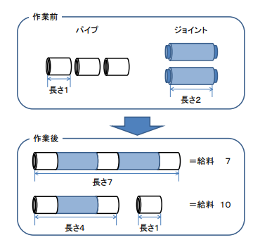

# パイプつなぎ職人の給料

難易度:★★

## 問題

ぼくはパイプつなぎ職人です。パイプをつなぐジョイントとパイプさえもらえれば、どんなパイプだっ
てつないでみせます。ぼくは毎日、親方からパイプとジョイントを渡されて、それをつないで親方に渡
します。でも、パイプの数が多すぎるときは、１日でそれを全部つなげることはできません。そんなと
きでも親方はにっこり笑って、ぼくに給料を渡してくれます。  
ところで、あるとき変なことに気がつきました。全部のパイプをつなげられたときより、つなげられな
かったときの方が給料が多いことがしょっちゅうあるんです。あんまり変なので、ある日、親方が来た
ときに、給料の計算方法が書いてあるメモをこっそり見ちゃいました。そしたら、なんと


って書いてありました。これで全部つなげた方が給料が安くなることがある理由がわかりました。たと
えば下図のように、長さ 1 のパイプ 3 本と長さ 2 のジョイント 2 本を全部つなげると長さ 1+2+1+2+1=7のパイプが 1 本できるので、1×(7)=7 です。  
でも、ジョイントを一つだけ使って長さ 1+2+1=4 のパイプと長さ 1 のパイプの 2 本にすると 2×(4+1)=10 なので、全部つなげるよりいっぱい給料がもらえます。




親方がなんでこんな方法で給料を決めてるかわからないけど、これでぼくもどうすればもらえる給料を
多くできるかわかりました！  

それでは、パイプの本数が与えられたとき、もらえる給料の最大の金額を計算するプログラムを作成し
てください。

### 入力
入力は複数のデータセットからなる。入力の終わりはゼロ１つの行で示される。各データセットは以下
の形式で与えられる。
```
n
pi ... pn
ji ... jn-1
```
１行目にパイプの本数n (2≦n≦65000)が与えられる。２行目は１つの空白で区切られたn個の整数から
なる。pi(1≦pi≦1000)はi番目のパイプの長さを示す。３行目は１つの空白で区切られたn-1 個の整数
からなる。j<sub>i</sub>(1≦j<sub>i</sub>≦1000)はi番目のジョイントの長さを示す。  

i番目のジョイントは、i番目とi+1番目のパイプだけをつなげることができる。つなげたパイプの長さ
は、p<sub>i</sub>+j<sub>i</sub>+p<sub>i+1</sub>になる。

データセットの数は100を超えない。


### 出力
各データセットごとに、得られる給料の最大の金額を 1 行に出力する。入力として与えられるデータセ
ットでは、出力される値は必ず３２ビット符号無し整数の範囲に収まるものとする。

### 入力例
```
3
1 1 1
3 3
4
3 3 3 3
1 1 1
5
1 2 3 4 5
4 3 2 1
0
```


### 出力例
```
12
48
76
```