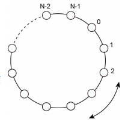

# 鉄道路線Ⅱ

難易度:★★

## 問題
わたしの住む街には、図のようなN個の駅からなる円環状の鉄道路線があります。この路線の各駅には 0
から N-1 までの番号が順番に割り当てられていて、隣の駅まで100 円で移動することができます。
移動はどちらの方向にでも可能です。 

わたしはこの路線上のいくつかの駅で買い物をしたいと思っています。
そこで、プログラムを作成して移動費を計算することにしました。



ある駅を始点として、買い物をするすべての駅を訪問する最小の費用
（円）を求めるプログラムを作成してください。ただし、同じ駅を何度
訪問しても良く、どのような順番で駅を訪問しても構いません。

### 入力
入力は以下の形式で与えられる。

```
N M p
d1
d2
:
dM
```
1行目に駅の数N(2≦N≦100000)、買い物をする駅の数M(1≦M≦10000 かつ M＜N)、出発する駅の番号p(0
≦p≦N-1)が与えられる。続くM行に買い物をする駅の番号d<sub>i</sub>(0≦d<sub>i</sub>≦N-1)が与えられる。ただし、d<sub>i</sub>は全て異なり、pもまたどのd<sub>i</sub>とも異なるものとする。

### 出力

最小の費用を１行に出力する

### 入力例
```
5 4 0
1
2
3
4 
```


### 出力例
```
400
```

### 入力例2
```
7 2 1
6
2 
```


### 出力例2
```
400
```
