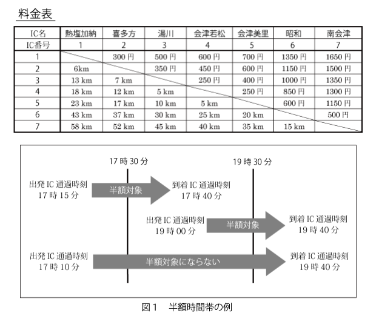

## 有料道路料金

難易度：★★

## 問題

20XX年に喜多方市熱塩加納町から南会津町までの6区間、総距離58kmの会津中央道路が完成し開通する予定です。開通後、半年間は利用促進のため17時30分～19時30分までに出発ICか到着ICを通過し、なおかつ走行距離が40km以下の車に対する通行料金は半額になります。ただし料金は50円単位とし、端数は切り上げます。下記の表は料金と距離の一覧表です。例えば喜多方（２）から会津若松（４）までは料金が450円、距離が12kmとなります。
半額時間帯であれば250円になります。出発IC、出発IC通過時刻、到着IC、到着IC通過時刻を入力とし、料金を計算して出力するプログラムを作成してください。  
ただし、入力される時刻は24時間表記の値であり、時間を表す h は0以上23以下の整数、分を表す m は0以上59以下の整数とし、ともに2桁で表示します。すなわち、値が10未満の場合は 01 のように一桁目を0で埋めて表記します。なお、17時30分および19時30分ちょうどに通過した場合も半額時間帯に含めます。 



プログラムは以下に定義する入力が続く限り処理を繰り返し、入力が終わったら終了するように作成してください。 


### 入力

複数のデータセットの並びが入力として与えられます。入力の終わりはゼロひとつの行で示されます。  
各データセットは以下のとおりです。

1行目 出発IC番号（整数）  
2行目 出発IC通過時刻 h m（整数 整数；半角空白区切り）  
3行目 到着IC番号（整数）  
4行目 到着IC通過時刻 h m（整数 整数；半角空白区切り）  

### 出力

入力データセットごとに通行料金（整数）を出力します。 

### 入力例

```
2
17 25
4
17 45
4
17 25
7
19 35
0 
```

### 出力例

```
250
1300 
```