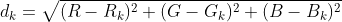

# どんな色？

難易度：★★

## 問題

ウェブデザイナーを目指す太郎君はただいま修行中。事務所の先輩から
「このページの背景色は#ffe085で」と、
ウェブデザイン特有の色番号で指示されるのですが、それがどんな色かパッと思い浮かべることができません。

この色番号は光の三原色である赤、緑、青それぞれの強さを表わしています。具体的には 2桁の16進数を 3つ組み合わせたもので、色番号を“#RGB”とするとき、R は赤の強さ、G は緑の強さ、Bは青の強さを表します。それぞれ00からffまでの値になります。
色番号にまだ不慣れな太郎君のために、色番号を入力とし、色の表の中からもっとも近い色の名前を出力するプログラムを作成してください。使用する色の表は以下の通りです。

| | 色の名前 |赤の強さ|緑の強さ|青の強さ|
|:-:|:-:|:-:|:-:|:-:|
| <span style="color:black;">■</span> |black|00|00|00|
| <span style="color:blue;">■</span> |blue|00|00|ff|
| <span style="color:lime">■</span> |lime|00|ff|00|
| <span style="color:aqua;">■</span> |aqua|00|ff|ff|
| <span style="color:red;">■</span> |red|ff|00|00|
| <span style="color:fuchsia;">■</span> |fuchsia|ff|00|ff|
| <span style="color:yellow;">■</span> |yellow|ff|ff|00|
| <span style="color:white;">■</span> |white|ff|ff|ff|

「もっとも近い色」とは、以下のように定義します。与えられた色番号での赤、緑、青の強さをそれぞれ R、G、B とし、表のk番目の色の赤、緑、青の強さをそれぞれ R<sub>k</sub>、G<sub>k</sub>、B<sub>k</sub>とするとき、次の式で計算する d<sub>k</sub> の値が最も小さい色がもっとも近い色とします。 




なお、dkの値が同じになる色が複数存在する場合は表の中でより上にある色がもっとも近い色になります。 

### 入力

複数のデータセットの並びが入力として与えられます。入力の終わりはゼロひとつの行で示されます。各データセットは以下の通りです。

1行目 色番号 #RGB（半角文字列） 

### 出力

入力データセット毎に最も近い色の名前を出力します。

### 入力例

```
#ffe085
#787878
#decade
#ff55ff
0 
```

### 出力例

```
white
black
white
fuchsia 
```

