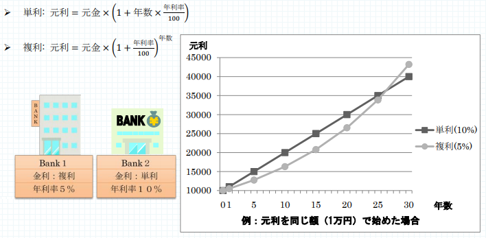

# 金利計算

難易度:★

## 問題
金利は銀行に預けているお金に付き、その計算方法や利率は銀行によって様々です。利息と元金を合わせた
ものを元利と呼びますが、元利の計算方法として、利息を元金に組み入れずに計算する「単利」と利息を元金
に組み入れて計算する「複利」というものがあり、より多くの元利を得るためにはこの差異を理解していなけ
ればなりません。
元利の計算方法は以下のようになります。



できれば、わずかな金利でもより多くお金を増やしたいと思うものです。相沢さんの家庭では、今まで預けていた銀行は金利が低い事に気づき、新しい銀行に乗り換えようとしています。しかし、相沢さん一家は金利のことについてあまり詳しく知らなかったので、金利に詳しいあなたに助けを求めてきました。比較すべき銀行の数は多いうえ、相沢さん一家以外にも助けを求められそうです。作業を効率化するためにより良い銀行を計算するプログラムを作成しておきましょう。

銀行の数 n、お金を預ける年数 y、各銀行の情報（銀行番号 b、金利の種類 t、年利率 r パーセント）を入力とし、最も元利が高くなる銀行番号を出力するプログラムを作成してください。ただし n、b はそれぞれ 1 以上50 以下の整数、y は 1 以上 30 以下の整数、r は 1 以上 100 以下の整数とします。また、金利の種類 t は、単利の場合は 1、複利の場合は 2 で与えられます。また、最も元利が高くなる銀行は一つだけです。


### 入力
複数のデータセットが入力として与えられます。入力の終わりはゼロひとつで示されます。各データセットは以下の通りです。  
1 行目 n (整数)  
2 行目 y (整数)  
3 行目 第 1 の銀行の情報 b r t (すべて整数 ; 半角空白区切り)  
4 行目 第 2 の銀行の情報  
：  
n+2 行目 第 n の銀行の情報  

### 出力
入力データセットごとに、最も元利が高くなる銀行番号を出力します。

### 入力例
```
2
8
1 5 2
2 6 1
2
9
1 5 2
2 6 1
0
```


### 出力例
```
2
1
```