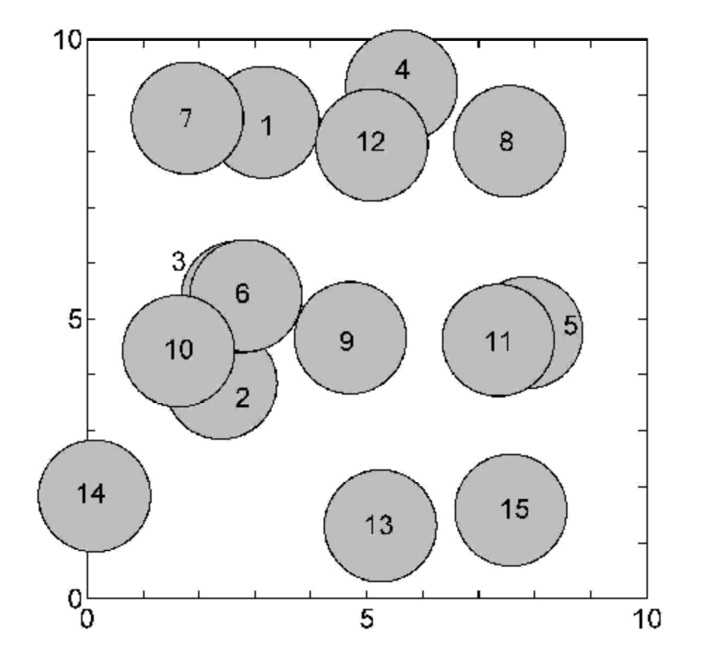

# シールの重なり

難易度：★★★★

## 問題

1 辺の長さが 10 の正方形の折り紙に半径 1 の円形のシールをn枚貼ります。
シールは重ねて貼ることができます。
シールを貼る位置の座標をファイルから読み込んで、折り紙上でもっとも多くシールが重なっている場所でのシールの枚数を出力して終了するプログラムを作成してください。
ただし、 nは 100 以下とします。

### 入力

折り紙の左下を原点とした x, y 座標を与えます。この x, y を円の中心としてシールを貼ることとします。円の中心が折り紙の外に出ることはありません。

x<sub>1</sub> , y<sub>1</sub> （1 枚目のシールの中心座標：全て実数）  
x<sub>2</sub> , y<sub>2</sub> （2 枚目のシールの中心座標：全て実数）  
x<sub>3</sub> , y<sub>3</sub> （3 枚目のシールの中心座標：全て実数）  
 ：  
 ：  
x<sub>n</sub> , y<sub>n</sub> （ n 枚目のシールの中心座標：全て実数）  

出力

折り紙上で最も多くシールが重なっている場所でのシールの枚数（整数）

### 入力例

```
3.14979,8.51743
2.39506,3.84915
2.68432,5.39095
5.61904,9.16332
7.85653,4.75593
2.84021,5.41511
1.79500,8.59211
7.55389,8.17604
4.70665,4.66125
1.63470,4.42538
7.34959,4.61981
5.09003,8.11122
5.24373,1.30066
0.13517,1.83659
7.57313,1.58150
```

### 出力例

```
4 
```

### 参考

入力例のようにシールを貼った図です。  
円はシール、数字は入力例の行数を表しています。
点(2.3,4.6)では、入力例の 2 行目、3 行目、6 行目、10 行目の 4 枚のシールが重なっています。 



6 と 9 のおのおのの中心の距離は 2.01293 なので、シールは重なっていません。  
1 と 12 のおのおのの中心の距離は 1.98231 なので、シールは重なっています。

２つの円が接しているとき（おのおのの中心の距離が 2 のとき）は、重なっているものとします。 