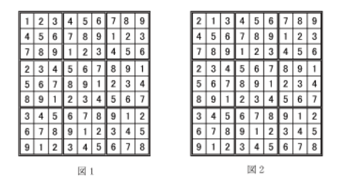

# パズル

難易度：★★

## 問題

たろう君は9×9のマス目に1～9の数字を配置するパズルで遊んでいます。このパズルでは以下の規則で
数字を配置しなければいけません。

- 同じ列に1つの数字はちょうど1回だけ現われる
- 同じ行に1 つの数字はちょうど1回だけ現われる
- 二重線で区切られた3×3の各範囲には、1つの数字はちょうど1回だけ現われる

例えば、下の図1はそのような規則を満たした配置の一つです。しかしたろう君は、図2のようによく規則に反した配置を作ってしまいます。左端の列に「2」が2回現われて、「1」が1回も現われず、左から2番目の列に「1」が2回現われて、「2」が1回も現われていません。たろう君を助けるために、数字の配置を読み込んで、その配置が規則を満たしているかどうかを調べ、規則に反していたらその場所を出力し終了するプログラムを作成してください。3つの規則に照らして誤っている（2回以上現れている）

数字の前には*（半角アスタリスク）を、誤っていない数字の前には空白を表示してください。




### 入力

パズルの状態を示す1行9文字、9行からなる数字列（整数；半角空白区切り）

### 出力

与えられた数字と*(半角アスタリスク)と空白。誤っている数字の前には*(半角アスタリスク)、誤っていない数字の前には半角空白を付加する。 

### 入力例

```
2 1 3 4 5 6 7 8 9
4 5 6 7 8 9 1 2 3
7 8 9 1 2 3 4 5 6
2 3 4 5 6 7 8 9 1
5 6 7 8 9 1 2 3 4
8 9 1 2 3 4 5 6 7
3 4 5 6 7 8 9 1 2
6 7 8 9 1 2 3 4 5
9 1 2 3 4 5 6 7 8 
```

### 出力例

```
*2*1 3 4 5 6 7 8 9
 4 5 6 7 8 9 1 2 3
 7 8 9 1 2 3 4 5 6
*2 3 4 5 6 7 8 9 1
 5 6 7 8 9 1 2 3 4
 8 9 1 2 3 4 5 6 7
 3 4 5 6 7 8 9 1 2
 6 7 8 9 1 2 3 4 5
 9*1 2 3 4 5 6 7 8 
```