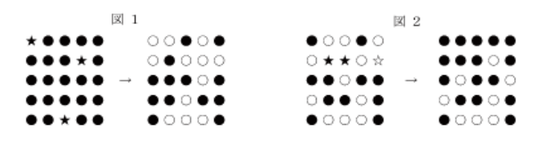

# 博士の奇妙な素粒子

難易度：★★★★

## 問題

博士 : ピーター君。やったよ。

ピーター : またですか。今度はどんなくだらない発明ですか。

博士 : あの幻の素粒子アキシオンの検出器を発明したんじゃ。

ピーター : アキシオンといえば、欧州合同原子核研究機構 (CERN) をはじめとする研究者たちが血眼で追っかけているという、あれですよね。本当ですかぁ？

博士 : 本当だってばよ。細かい説明は省くが、非常に強力な磁場を内蔵する特殊な光電管が光ることによって、通過するアキシオンを検出する。

ピーター : 他 に先んじて検出すれば、小柴先生のニュートリノ検出に匹敵する
ノーベル賞級の研究ですよ。
これで役立たずの研究ばかりしている「ダメ研究室」などという汚名も返上できますね。

博士 : そうだとも。小柴先生の「スーパーカミオカンデ」にあやかって、この装置を、（悪口言ったら）「タダジャオカンデ」と命名した。

ピーター : ちょっと苦しいって言うか、卑屈って言うか・・・。

博士 : それはいいとして、この装置ちょっとした癖があるんじゃよ。
アキシオン粒子がある光電管を通過すると、感度の関係でその光電管と
隣接する上下左右の光電管が反応する。 



ピーター : つまり、図1の左側★印の光電管を粒子が通過した場合、
右側のように点灯すると言うことですね。
（図は 5 × 5 の例。黒は消灯・白は点灯状態。以下同じ。）

博士 : また反応とは、光電管の状態が反転する。つまり消えている光電管は光り、光っている光電管は消える。

ピーター : つまり、図２の左側の★印や印を粒子が通過した場合、右側のような状態になると。

博士 : これを正方形になんと 100 個 (10 × 10) 配置して待ち受けるわけだ。

ピーター : これだけの大発明、ノーベル賞選考委員会も「ホッチャオカンデ」なんて。

博士 : おぉピーター君、君も我が研究室の作風になじんできたようだね。いい感じだ。では、早速実験を始めよう。まずはこの装置、現在ランダムに光電管が点いているので、
実験が始められるように全部消えた状態にリセットしてくれたまえ。なあに、どの光電管にアキシオン粒子を当てれば全部消えるか考えればいいだけじゃよ。簡単だろう？

ピーター : 考えるのはいいんですが博士。当てるためには、
幻のアキシオン粒子を発生させて打ち込める装置がないといけないんじゃないです
か。

博士 : ・・・。 

博士とピーター : （同時に）コリャアカンデ！だははは・・・・。 


ということで、本日も和気あいあいと暮れてゆく博士の研究室ですが、例によって話は全く進みそうもありません。しょうがないので、ピーター君に代わってプログラムを作成してあげてください。

プログラムは次のようなものになります。

1. 装置の光電管の状態を 10 × 10 の配列として入力します。0は消灯中、1は点灯中を表します。
0と1以外のデータは含まれません。
2. 入力した装置の状態をすべて消灯にするために、アキシオン粒子を通過させる位置を計算して出力します。これは、入力と同じ 10 × 10の配列で光電管の位置を表します。「0は通過させない」、「1は通過させる」ことを表します。すべてを消灯する方法は必ず1通りだけ存在するものとします。
なお、以下はヒントです。
    - 粒子を通過させる順番は結果に関係ありません。
    - 粒子を偶数回通過させることは通過させないことと同じです。 また、奇数回通過させることは1回通過させることと同じです。
    -  以上から、すべての光電管について0（通過させない）と 1（通過させる）のどちらかを選択することがすなわち解答になります。
3. プログラムを終了します。 


### 入力

１行目 装置の1行目の光電管の状態を示す 10 個の数字（整数 0 または 1; 半角空白区切り）
２行目 装置の2行目の光電管の状態を示す 10 個の数字（整数 0 または 1; 半角空白区切り）
 ：
 ：

### 出力

１行目 装置の1行目の光電管に粒子を通過させるかいなかを示す 10 個の数字
 （整数 0 または 1; 半角空白区切り）
２行目 装置の2行目の光電管に粒子を通過させるかいなかを示す 10 個の数字
 （整数 0 または 1; 半角空白区切り）
 ：
 ： 

### 入力例

```
0 1 0 0 0 0 0 0 0 0
1 1 1 0 0 0 0 0 0 0
0 1 0 0 0 0 0 0 0 0
0 0 0 0 1 1 0 0 0 0
0 0 0 1 0 0 1 0 0 0
0 0 0 0 1 1 0 0 0 0
0 0 0 0 0 0 0 0 0 0
0 0 0 0 0 0 0 0 1 0
0 0 0 0 0 0 0 1 1 1
0 0 0 0 0 0 0 0 1 0 
```

### 出力例

```
0 0 0 0 0 0 0 0 0 0
0 1 0 0 0 0 0 0 0 0
0 0 0 0 0 0 0 0 0 0
0 0 0 0 0 0 0 0 0 0
0 0 0 0 1 1 0 0 0 0
0 0 0 0 0 0 0 0 0 0
0 0 0 0 0 0 0 0 0 0
0 0 0 0 0 0 0 0 0 0
0 0 0 0 0 0 0 0 1 0
0 0 0 0 0 0 0 0 0 0 
```

