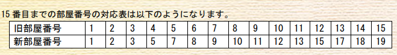

# 病院の部屋番号

難易度:★★★

## 問題
国によっては忌み数（いみかず）として嫌われる数字を部屋番号に用いたくない人がいます（日本
では 4 と 9 が有名です）。しかし、この病院の部屋番号は忌み数に関係なく、1 から順番に付けられて
いました。  
それが気になったデブンキーさんは、機材やベッドの入れ替えが全て終わる前にウォーターデブン
の忌み数である「4」と「6」を除いた数字で部屋番号を付けなおしてしまいました。しかし、入れ替
え作業は旧部屋番号で計画していたので、残りの作業を確実に行うには旧部屋番号を新部屋番号に変
換する必要があります。計算が苦手なデブンキーさんはこのことに気づいて愕然としています。  
そんなデブンキーさんのために、旧部屋番号を入力とし対応する新部屋番号を出力するプログラム
を作成してください。ただし、旧部屋番号は 1 以上 1,000,000,000 以下の整数とします。



### 入力
複数のデータセットの並びが入力として与えられます。入力の終わりはゼロひとつの行で示されます。
各データセットは以下の通りです。  
1 行目 旧部屋番号 n（整数）

### 出力
入力データセットごとに、新部屋番号を出力します。
### 入力例
```
15
100
1000000000
3
0
```


### 出力例
```
19
155
9358757000
3 