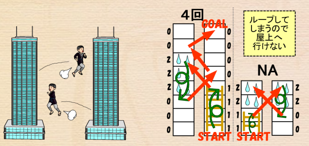

# 忍者のビル登り

難易度:★★★

## 問題
あつしさんは二つ並んだ同じ階数のビルの壁を跳び移りながら、ビルの屋上を目指します。ジャンプ
はどちらか一方のビルの１階から始められます。向かい側のビルへジャンプするときには、同じ階・1
つ上の階・2 つ上の階の、いずれかに飛び移ることができます。
壁には以下の 3 種類があり、それぞれの壁にジャンプした後の移動が決まっています。

0. 普通の壁：上下の移動はしない。次のジャンプはそこから行う。
1. はしご ：はしごは 2 つ以上の階にまたがってかかっており、今いるはしごの一番上まで
移動する。次のジャンプはそこから行う。
2. すべる壁：普通の壁かはしごの一番上まで滑り落ちる。次のジャンプはそこから行う。
また、壁は 1 階から屋上のすぐ下の最上階まであり、屋上へはそのビルの最上階からのみ行くことが
できます。また、ビルの最下階の壁はすべる壁にはなりません。

2 つのビルの階数 n と 2 つのビルの壁の種類を入力とし、最少で何回目のジャンプで最上階までたど
り着き、屋上まで行くことができるかを出力するプログラムを作成してください。なお、どちらのビル
の屋上にたどり着いてもよいものとします。ただし、n は 3 以上 100 以下の整数とします。また、あつしさんがどちらのビルの屋上へもたどり着けない場合は“NA”と出力してください。



### 入力
複数のデータセットの並びが入力として与えられます。入力の終わりはゼロひとつの行で示されます。  
各データセットは以下のとおりです。  
1 行目 ビルの階数 n（整数）  
2 行目 1 つ目のビル a の 1 階から n 階までの壁の情報 a1 a2 … an（すべて整数；半角空白区切り）  
 各 aiは、i 階目の壁の情報を表し、意味は以下のとおりです。  
 0：普通の壁  
 1：はしご（i 階と i+1 階にまたがる）  
 2：すべる壁  
3 行目 2 つ目のビル b の 1 階から n 階までの壁の情報 b1 b2 … bn（すべて整数；半角空白区切り）

### 出力
入力データセットごとに、ジャンプの回数を出力します。

### 入力例
```
8
0 0 0 2 2 2 0 0
1 1 1 1 0 0 0 0
4
1 1 2 2
0 0 2 2
0
```


### 出力例
```
4
NA
```