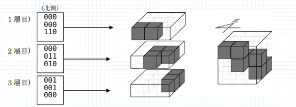
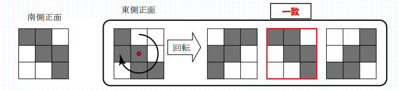

# 絵柄の一致

難易度:★★★

## 問題
会津芸術館では、立方体ブロックを積み上げて出来た特殊な立方体の装置が人気です。この装置の各ブロックは点灯命令によって透明になったり、黒くなったりして、オブジェを浮かび上がらせることができます。  
会津芸術館は創立記念を飾るため、「南から見ても東から見ても同じ絵柄」をテーマとしたオブジェを募集しました。しかし、応募された作品を点灯命令に変換した段階で、テーマに反する絵柄になるものが混ざっていることに気づきました。このような作品を区別するため、点灯命令が「南から見ても東から見ても同じ絵柄」となるかどうかを判断するプログラムを作成してください。  



装置は同じ大きさの立方体ブロックが n×n×n 個積み重なって出来ています。各ブロックは点灯命令によって透明か、黒かのいずれかの状態になります。点灯命令は装置を構成するブロックの層ごとに与えられます。
層ごとの点灯命令は、n×n の表として与えられます。この表は、1 行目が最も北側のブロックの列、n 行目が南端のブロック列に対応するように並んでいます。各行は、西側のブロックに対する命令から、透明のまま“0”（ゼロ）か黒くする“1”か、のどちらかで与えられます。下図は、3 層分の表が与えられたときのオブジェの例です。



### 入力
複数のデータセットの並びが入力として与えられます。入力の終わりはゼロひとつの行で示されます。 各データセットは以下のとおりです。  
1 行目 装置の大きさ n （整数）  
2 行目 1 層 1 行目の点灯命令 r111 r211 ... rn11 （すべて半角数字）  
3 行目 1 層 2 行目の点灯命令  
:  
n+1 行目 1 層 n 行目の点灯命令  
n+2 行目 2 層 1 行目の点灯命令  
:  
n2+1 行目 n 層 n 行目の点灯命令

### 出力
入力データセットごとに、yes または no と出力します。

### 入力例
```
3
000
000
110
000
011
010
001
001
000
3
000
001
000
000
000
000
000
000
000
2
10
11
10
00
0
```


### 出力例
```
yes
no
yes
