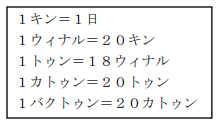
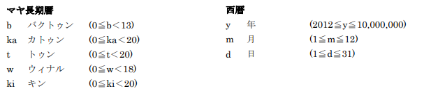

# マヤの大予言

難易度:★★★

## 問題
真也君はテレビで「マヤの大予言！2012 年で世界が終わる？」という番組を見ました。結局、世界が終
るかどうかはよくわかりませんでしたが、番組で紹介されていたマヤの「長期暦」という暦に興味を持
ちました。その番組では以下のような説明をしていました。

マヤ長期暦は、右の表のような単位からなる、全部で 13 バクトゥン(187 万 2000 日)で構成される非常に長い暦である。ある計算法では、この暦は紀元前 3114 年 8 月 11 日に始まり 2012 年12 月 21 日に終わると考えられていて、このため今年の 12 月21 日で世界が終わるという説が唱えられている。
しかし、13 バクトゥンで１サイクルとなり、今の暦が終わったら新しいサイクルに入るだけという考えもある。



「ぼくの二十歳の誕生日はマヤ暦だと何日になるのかな？」真也君はいろいろな日をマヤ長期暦で表し
てみたくなりました。

では、真也君の代わりに、西暦とマヤ長期暦とを相互変換するプログラムを作成してください。

### 入力
入力は複数のデータセットからなる。入力の終わりは#１つの行で示される。各データセットは以下の
形式で与えられる。

```
b.ka.t.w.ki
```
又は、
```
y.m.d
```
データセットは１つの文字列を含む１行からなる。b.ka.t.w.kiはマヤ長期暦の日付、y.m.d は西暦の日付である。与えられる単位は以下の通りである。



西暦の日の最大値は、大の月、小の月、うるう年かどうかで変わる(うるう年は 4 の倍数の年のうち、
100 で割り切れない年か、400 で割り切れる年である)。マヤ長期暦の日付の範囲は 0.0.0.0.0 から
12.19.19.17.19 までとする。ただし、マヤ長期暦の 0.0.0.0.0 は西暦の 2012.12.21 に対応する。
また、西暦の日付の範囲は 2012.12.21 から 10000000.12.31 までとする。
データセットの数は 500 を超えない。

### 出力

入力が西暦のときはマヤ長期暦を、マヤ長期暦のときは西暦を、それぞれ入力と同じ形式で出力する。
入力された西暦を換算した結果、マヤ長期暦の次のサイクルに入った場合でもb.ka.t.w.kiの形式で出力してよい。

### 入力例
```
2012.12.31
2.12.16.14.14
7138.5.13
10.5.2.1.5
10000000.12.31
#
```


### 出力例
```
0.0.0.0.10
3054.8.15
0.0.0.0.10
6056.2.29
8.19.3.13.2
```
