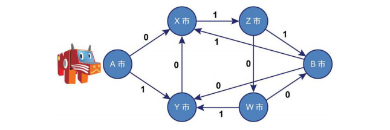

# アカ・ベコと40人の盗賊

難易度:★★★

## 問題
40 人の盗賊から逃れようとしているアカ・ベコは、A 市の街中で道に迷ってしまった。アカ・ベコは新しいアジトがある B 市に行きたいのだが地図を盗賊に盗まれてしまった。

盗賊の一人であるコボー氏はアカ・ベコに同情し、気の毒に思っていた。そこで、密かにアカ・ベコに、「あなたが B 市に行くお手伝いをしたいが、仲間にばれない様にしなければならないので、直接道順を教えたいが教えることができない。しかし、あなたの質問には答えられる。」と伝言を送った。

コボー氏は、「○○という道順はどうか。」という質問をアカ・ベコから受け取ると、それが A 市から B市までちょうどたどり付ける道順なら Yes、そうでなければ No という答えを伝える。道順のチェックは以下の地図に従って行う。





各都市は一方通行の道でつながっており、それぞれの道には、0 か 1 の数字が付いている。アカ・ベコは数字の並びで道順を指定する。
例えば、0100 は A 市から X、Z、W 市を経由して B 市にちょうどたどり着く道順である。地図にない道順を選ぶと砂漠に迷い込んでしまい、決して B 市にたどり着くことはない。
アカ・ベコは自分がいる都市の名前を知ることはできないため、道順をたどり終えたときにちょうど B 市に到達する必要がある。

コボー氏はアカ・ベコからの質問に答えるために、あなたを密かに雇いプログラムの作成を依頼した。
アカ・ベコからの質問を入力すると、それが A 市から B 市にちょうどたどり付ける道順なら Yes、そうでなければ No と出力するプログラムを作成してほしい。 
### 入力

入力は複数のデータセットからなる。入力の終わりは#（シャープ）１つの行で示される。各データセ
ットは以下の形式で与えられる。
```
p
```
１行に道順を示す数字 0,1 の並び p が与えられる。p は100文字を超えない文字列である。 
データセットの数は 100 を超えない。 

### 出力

データセットごとに、Yes または No を１行に出力する。 

### 入力例
```
0100
0101
10100
01000
0101011
0011
011111
# 
```


### 出力例
```
Yes
No
Yes
No
Yes
No
Yes 
```

- ４つ目のデータセットでは、B 市を通りすぎて Y 市に到達する道順なので No と出力する。
- ５つ目のデータセットでは、同じ都市を何度か通っているが、B 市にちょうどたどり着く道順なの-で Yesと出力する。
- ６つ目のデータセットでは、X 市から砂漠に迷い込んでしまい B 市にはたどり着けないので No と出力する。
- 最後のデータセットでは、B 市をいったん通り過ぎてから、X 市と Z 市を経由して B 市にちょうどたどり着く道順なので Yes と出力する。