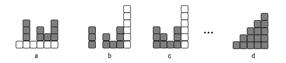

# ブロックの三角形

難易度:★★★

## 問題

図 a のように積まれたブロックに対し、以下の並べ替え操作を繰り返す。
1. 一番下のブロック全て（図 a 中の白のブロック）を右端に新しく積み上げる（残りのブロックは自
動的に１段下に落ち、図 b のようになる）。
2. ブロックの間に隙間ができたら、左に詰めて隙間をなくす（図 b から図 c のようになる）。

1 以上の整数 k に対して、k×(k＋1)/ 2 で表される数 (例:1, 3, 6, 10, ...)を三角数という。ブロックの総数が三角数の場合、上記の並べ替えを繰り返すと、左端の高さが 1 で右に向かって１つずつ高くなっていくような三角形になると予想されている（図 d は総数が 15 個の場合）。 



ブロックの最初の並びが与えられたとき、あらかじめ決められた回数以下の操作で、上で説明したよう
なブロックの三角形ができるとき、三角形が得られるまでの最小の操作回数を出力するプログラムを作
成してください。


### 入力

入力は複数のデータセットからなる。入力の終わりはゼロ１つの行で示される。各データセットは以下
の形式で与えられる。

```
N
b1 b2 ... bn
```
各データセットは２行であり、ブロックの最初の並びを表す。N(1≦N≦100)は、一番下の段にあるブロ
ックの数を示す。b<sub>i</sub>(1≦b<sub>i</sub>≦10000)は左からi番目の位置に積まれているブロックの数を示す。ただし、ブロックの総数は 3 以上である。

データセットの数は 20 を超えない。


### 出力

データセットごとに、三角形ができるまでに行った並べ替え操作の回数を１行に出力する。ただし、三
角形が作れない場合や、操作回数が 10000 回を超える場合は -1 を出力する。

### 入力例
```
6
1 4 1 3 2 4
5
1 2 3 4 5
10
1 1 1 1 1 1 1 1 1 1
9
1 1 1 1 1 1 1 1 1
12
1 4 1 3 2 4 3 3 2 1 2 2
1
5050
3
10000 10000 100
0 
```


### 出力例
```
24
0
10
-1
48
5049
-1 
```

- 最初のデータセットが、図に示した場合に対応する。
- ４つ目のデータセットが、ブロックの総数が三角数でないため、三角形が作れない場合に対応する。
- 最後のデータセットが、ブロックの総数は三角数だが、操作回数が10000回を超える場合に対応する。 