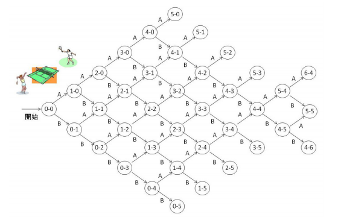

# テニス

難易度:★★★

## 問題
ジョウ君とヤエさんは昼休みにテニスをします。ただし、昼休みは時間が限られているので、短い時間
で終わるように、得点について以下の３つのルールで行います。

- 相手が３点以下のときに先に５点とれば勝ち。
- ４対４の同点になったときは、その直後に連続して２点とった方が勝ち。
- ４対４の後に双方が１点ずつとったときは引き分け。

以下の図は、ジョウ君とヤエさんの試合で起こり得るすべての状況を表しています。丸の中の左の数が
ジョウ君の得点、右がヤエさんの得点です。Ａと書いた矢印はジョウ君が１点とったことを、Ｂと書い
た矢印はヤエさんが１点とったことを表します。



ジョウ君とヤエさんの得点が与えられたとき、試合開始からその得点状況になるまでに、上の図で通り
得るすべての経路を列挙するプログラムを作成してください。

### 入力
入力は１つのデータセットからなる。入力データは以下の形式で与えられる。

```
j y
```
j(0≦j≦6)がジョウ君の得点、y(0≦y≦6)がヤエさんの得点である。ただし、j と y がともに 0 である
ことはない。また、j が 6 のときは y は 4、y が 6 のときは j は 4 である。

### 出力
上の図で、試合開始（0-0 と書かれた丸）から与えられた得点が書かれた丸までのすべての経路を出力
する。経路は図の矢印に添えられた英字(A,B)の列で表し、辞書式順序（英和辞書で単語が並んでいる
順番）になるように並べる。１つの経路を１行に出力する。経路の前後には空白を出力しない。

### 入力例1
```
2 2
```


### 出力例1
```
AABB
ABAB
ABBA
BAAB
BABA
BBAA
```
### 入力例2
```
5 1
```


### 出力例2
```
AAAABA
AAABAA
AABAAA
ABAAAA
BAAAAA
```