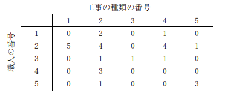

# 親方の給料計算

難易度:★★★

## 問題
ワシはパイプつなぎ組合の親方じゃ。職人を工事現場に派遣し、現場でパイプをつながせておる。去年
は工事が増えて大儲けするかと思ったのじゃが、ちょっと給料の出し方がまずくてのぅ。ウチとしては
大赤字になってしまったのじゃよ…。そこで、今年は職人たちへの給料の出し方を工夫したいのじゃ。

職人たちの給料は、工事の種類とこなした回数で決めておる。つまり、
職人の給料 ＝ 種類 1 の単価×種類 1 をこなした回数
＋種類 2 の単価×種類 2 をこなした回数
・・・・
＋種類 M の単価×種類 M をこなした回数

となるのじゃ。これを計算するために、ウチでは、どの職人がどの種類の工事を何回こなしたかを次の
ような表に記録しておる。



例えば、上の表では、職人１が工事２を２回、工事４を１回こなしたことを示しておる。

職人たちがこなした仕事の回数はもう変えられんが、やつらは工事の単価を知らんので、単価をいろい
ろと変えながら皆の不満が出ぬよう給料を調整しようと思うておる。じゃが、ワシがこしらえたプログ
ラムが今もって動かなくてのぅ。ちょっとみてくれんかね。
```
//省略
int i, j;
for ( i = 0; i < N; i++ ){
 c[i] = 0;
 for ( j = 0; j < M; j++ ){
 c[i] = c[i] + a[i][j]*b[j];
 }
}
//省略
```
N は職人の数で M は工事の種類の数じゃ。変数 a[i][j]に職人 i が工事 j をこなした回数を、b[j]に工事 j の単価をいれて、c[i]に職人 i の給料を格納しておる。合っているはずなのに、うんともすんとも言わん！そろそろ今年の給料を職人たちに払わないとまずいのじゃが・・・・・なんとかならんかのぅ。

それでは、職人のこなした仕事の回数と各工事の単価の情報が与えられたとき、各職人の給料を計算す
るプログラムを作成してください。

### 入力

入力は 1 つのデータセットからなる。入力データは以下の形式で与えられる。

```
N M
s1 t1 e1
s2 t2 e2
:
0 0 0
L
b11 b12 ... b1M
b21 b22 ... b2M
:
bL1 bL2 ... bLM
```

- 1 行目は職人の数 N(1≦N≦10000)と工事の種類の数 M(1≦M≦10000)。
- 続いて、工事の記録として、職人の番号 si(1≦si≦N)と工事の種類の番号 t<sub>i</sub>(1≦t<sub>i</sub>≦M)、および職
人 siが工事 t<sub>i</sub>をこなした回数 e<sub>i</sub>(1≦e<sub>i</sub>≦50000)からなる行が１行以上与えられる。工事の記録は
ゼロ３つの行で終わる。ただし、e<sub>i</sub>の合計は 1 以上 50000 以下である。また、工事の記録には、どの職人と工事の種類の組も２度以上現れない。工事をこなした回数が 0 である職人と工事の種類の
組は与えられない。
- 続く 1 行は給料の算出を行う回数 L(1≦L≦100)。
- 続くL行は、i回目の給料の算出に必要な、工事jの単価b<sub>ij</sub>(0≦b<sub>ij</sub>≦10000)の並び。

### 出力

以下の形式で、i 回目の給料の算出によって得られた職人 j の給料 c<sub>ij</sub>を順番に出力する。各給料の間は空白１つで区切る。

```
c11 c12 ... c1N
c21 c22 ... c2N
:
cL1 cL2 ... cLN
```

### 入力例
```
4 6
1 2 1
2 3 2
2 4 3
3 1 5
4 2 4
4 3 2
4 6 10
0 0 0
3
1 3 2 4 0 10
6 5 4 3 2 1
5 1 1 5 5 1
```


### 出力例
```
3 16 5 116
5 17 30 38
1 17 25 16
```