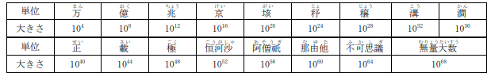
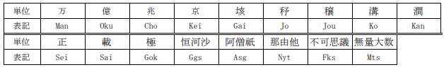

# 塵劫記

難易度:★★★

## 問題
大きな数を表そうとすると、文字数も多くなるし、位取りがわからなくなってしまうので、なかなか面
倒です。大きな数をわかりやすく表すために、人々は数の単位を使ってきました。江戸時代に書かれた
「塵劫記」という本の中では、数の単位が次のように書かれています。



たとえば、２の１００乗のようなとても大きな数は、１２６穣７６５０𥝱𥝱６００２垓２８２２京９４０１兆４９６７億３２０万５３７６と表せます。それでは、正の整数mとnが与えられたとき、mのn乗を塵劫記の単位を使って上のように表すプログラムを作成してください。

### 入力
入力は複数のデータセットからなる。入力の終わりはゼロ２つの行で示される。各データセットは以下
の形式で与えられる。

```
m n
```
m(2≦m≦20)が基数、n(1≦n＜240)が指数を表す。ただし、m<sup>n</sup>は10<sup>72</sup>未満である。
データセットの数は100を超えない。
### 出力
データセットごとに、m<sup>n</sup>を塵劫記の単位で表した文字列を 1 行に出力する。ただし、各単位は以下の表記で出力する。



m<sup>n</sup>を表す文字列は、1から9999までの数と上の表に現れる単位を表す文字列からなる。文字列には、余分な0や単位を含めない。

### 入力例
```
2 10
5 20
10 8
20 17
0 0
```


### 出力例
```
1024
95Cho3674Oku3164Man625
1Oku
131Gai720Kei
```
