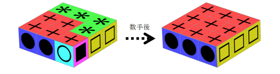
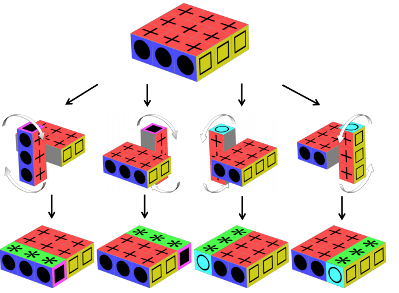
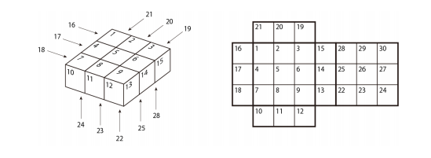

# フロッピーキューブ

難易度:★★★

## 問題
フロッピーキューブをプログラミングで解いてみましょう。フロッピーキューブは図のように表面に色
のついた９個の立方体から構成されている立体パズルで、キューブの列を回転させることによって、６
つの各面の色をそろえます。



フロッピーキューブに対しては下図のような４種類の操作を行うことができ、一回の操作で、端にある
３つの隣接したキューブを１８０度回転することができます。わかりやすいように、図では、上面に＋
(赤色)、下面に＊(緑色)、右前面に□(黄色)、左前面に●(青色)、右奥面に○(水色)、左奥面に■(紫
色)の記号が付いている状態を初期状態としています。



フロッピーキューブの初期状態が与えられるので、パズルを解くために必要な最小の操作回数を求める
プログラムを作成してください。

### 入力

入力は以下の形式で与えられる。
```
N
puzzle1
puzzle2
:
puzzleN 
```
１行目のN(1≦N≦30)は操作回数を計算したいパズルの数である。続くN行に各フロッピーキューブの初
期状態puzzle<sub>i</sub>が与えられる。puzzle<sub>i</sub>は以下の形式で与えられる。
```
p1 p2 ... p30
```
各フロッピーキューブの情報は30個の整数 p<sub>i</sub>(1≦p<sub>i</sub>≦6)からなる。p<sub>i</sub>は、下図のようにフロッピーキューブの各面に番号iを振ったときの、そのキューブの面の色を表す。



パズルは、多くとも８回の操作で解くことができると仮定してよい。

### 出力
パズルごとに、最小の操作回数を１行に出力する。
### 入力例

```
4
1 1 1 1 1 1 1 1 1 2 2 2 4 4 4 6 6 6 5 5 5 3
3 3 3 3 3 3 3 3
3 3 3 1 1 1 1 1 1 2 2 2 4 4 6 4 6 6 5 5 5 3
3 3 3 3 3 1 1 1
3 3 3 1 1 3 1 1 1 2 2 5 6 4 4 4 6 6 2 5 5 3
3 3 1 3 3 1 1 1
1 3 1 3 1 3 3 1 3 2 2 2 6 4 4 6 6 4 5 5 5 1
3 1 1 3 1 3 1 3
```

※入力例で、各フロッピーキューブの初期状態におけるキューブの面の色を表す数列は、表示の都合
上２行に見えるが、実際は１行である。

### 出力例
```
0
1
2
7 
```
