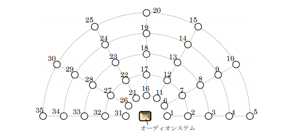
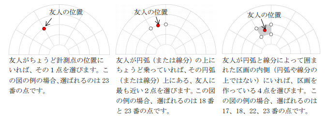

# 有益氏のオーディオルーム

難易度:★★★

## 問題

数学者である有益氏の趣味は音楽鑑賞で、家に念願のオーディオルームを作りました。完成したオーデ
ィオルームで、友人を招いてお披露目会を開きたいと考えています。全員にできるだけ良い音で聴いて
もらいたいので、部屋の中の何か所かで音を計測し、友人たちの位置での音の質を計算するつもりです。しかし、そのために必要な計測点を選択するのは面倒です。
計測点は、下の図の円弧と線分の交点である 1 番から 35 番までの点から選択します。１つの線分上にある点は、オーディオシステムからの距離が 100ｃｍから 500ｃｍまで 100ｃｍずつ離れて並んでいます。
１つの円弧状にある点は、もっとも右のもの（1 番から 5 番までの点）から反時計回りに、0°から 180°の範囲で 30°度刻みに並んでいます。



このような円弧と線分に囲まれた領域内のどこかに友人が居ることになるので、友人の居る位置によっ
て必要な計測点を選択します。友人の位置は、円弧に沿って反時計回りに測った角度とオーディオシス
テムからの距離で与えられます。必要な計測点は以下のように１点か、２点か、４点が選ばれます。



有益氏を助けるために、必要な計測点の番号を求めるプログラムを作成してください。

### 入力
入力は以下の形式で与えられる。
```
N
r1 t1
r2 t2
:
rN tN
```
１行目に友人の数N(1≦N≦50)が与えられる。続くN行に、友人の位置が与えられる。友人の位置r<sub>i</sub>(100≦r<sub>i</sub>≦500)はオーディオシステムからの距離を表す整数、t<sub>i</sub>(0≦t<sub>i</sub>≦180)は円弧に沿って反時計回りに測った角度を表す整数である。

### 出力

各友人の位置について、計測点の番号を昇順で１行に出力する。

### 入力例
```
4
300 120
300 105
250 105
250 90
```


### 出力例
```
23
18 23
17 18 22 23
17 18
```