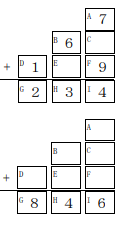

# 虫食い算

難易度:★★★

## 問題

足し算は筆算で簡単に計算できますが、もし、いくつかの数字が欠けていたら、欠けている数字を埋めるのは簡単でしょうか？ 例えば、右のような筆算において、１から９の数字が一度しか現れないという条件があるとき、ＣとＥのマスに入る数字はいくつになるでしょう？   
この場合、Ｃに入るのは８，Ｅに入るのは５が正解となります。このように、数字がいくつか欠けている演算を虫食い算と呼びます。
１から９の数字が一度しか現れないという条件はそのままで、右のようにもっとたくさんの数字が欠けていたら、正解となる数字の埋め方は一通りしかないのでしょうか？ 実は、必ず一通りに決まるとは限りません。



上の図のような形をした虫食い算の、ＡからＩの各マスの情報が与えられたとき、正しい埋め方が何通
りあるかを出力するプログラムを作成せよ。
### 入力
入力は以下の形式で与えられる。
```
A B C D E F G H I
```
１行に、虫食い算のＡからＩのマスに入っている数字の情報が与えられる。ただし、与えられた値が-1
のときは、そのマスの数字が欠けていることを表す。-1以外の値は、1から9の整数のいずれかで、それ
らの間に重複はない。
### 出力
正しい埋め方が何通りあるかを１行に出力する。

### 入力例1
```
7 6 -1 1 -1 9 2 3 4 
```
### 出力例1
```
1

```
### 入力例2
```
7 6 5 1 8 9 2 3 4
```
### 出力例2
```
0
```
### 入力例3
```
-1 -1 -1 -1 -1 -1 8 4 6
```
### 出力例3
```
12
```
### 入力例4
```
-1 -1 -1 -1 -1 -1 -1 -1 -1
```
### 出力例4
```
168
```