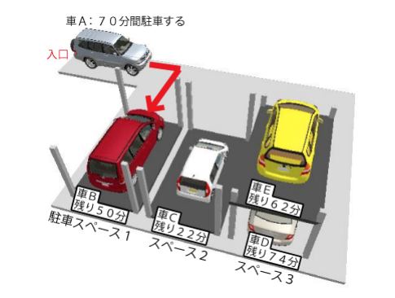

# ２段式駐車場

## 問題

街中には駐車場の利用効率を上げるため、立体式やタワー式などの様々な駐車場があります。その中には、ひとつの駐車スペースに図のような「２段式駐車装置」を設置し、２台分の駐車スペースを確保している駐車場もあります。この２段式駐車装置は１台を昇降式のパレット（車を乗せる平らな鉄板）に乗せて上段に駐車させ、もう１台を下段に駐車することができます。
このような２段式駐車装置を用いている駐車場では、上段の車を出し入れするのに、その都度、下段に駐車されている車を出して、退かす必要があるので、必ず管理人さんが駐車している車のカギを預かって、必要に応じて車の出し入れを行います。

鶴ヶ駐車場もこのような２段式駐車装置を設置している駐車場のひとつですが、人手不足のため、車の運転ができない人が管理人になってしまいました。そのため、一度駐車した車はお客さんが戻るまで動かすことができず、上段になった車は下段の車の持ち主が戻ってからでないと車を出すことができない状態になってしまいました。
そんな条件付きでも、鶴ヶ駐車場は立地条件が良く、使うお客さんがたくさんいました。次から次へと駐車しに来る車を手際よくさばかなければならない管理人さんを手伝うため、鶴ヶ駐車場のルールを満たすプログラムを作成してください。 

#### 鶴ヶ駐車場の設備

- 駐車スペースは１つ以上あり、全て２段式駐車装置が設置されています。
- 各駐車スペースには１から順に番号が割り振られています。
- 初めは駐車場に１台も駐車していないものとします。 

鶴ヶ駐車場は以下のようなルールを採用しています。

#### 車を止める時

- 駐車する車の駐車時間が管理人に知らされます。
- １台も駐車されていない駐車スペースから先に駐車していきます。
- １台も駐車されていない駐車スペースがない場合には、空いている駐車スペースに駐車します。
    ただし、そのような駐車スペースが複数あるときは以下の手順で駐車します。
    1. 駐車してある車の残り駐車時間が駐車しようとしている車の駐車時間以上のものがある場合、そのが一番小さい駐車スペースに駐車します。
    2. 駐車してあるどの車の残り駐車時間も駐車しようとしている車の駐車時間未満である場合、その差が一番小さい駐車スペースに駐車します。
- 満車（空いている駐車スペースがない）の場合、駐車しようとする車は駐車スペースが空くまで順番に待ちます。空いたと同時に、最初に待っていた車から順に駐車します。

※各条件において、該当する駐車スペースが複数ある場合は駐車スペース番号の最も小さいところに駐車することとします。また、同時刻に出庫する車がある場合は、出庫する車がすべて出てから駐車を始め、待っている車がある限り、駐車できるだけの車が同時刻に駐車することとします。 

#### 車が出る時

- 管理人に知らされた駐車時間を過ぎた車は出庫します。
- 複数の駐車スペースで同時に駐車時間を過ぎた車があった場合、駐車スペース番号の小さい車から先に出庫します。
- 上段に駐車した車の駐車時間が過ぎた場合、下段の車が出庫するまで待たなければなりません。上段の車は下段の車が出庫した後、同時刻に出庫します。 

下図で鶴ヶ駐車場の駐車方法の例を示します。この例では、駐車スペースの数は3で、車 B ～車 Eがすでに駐車してあるとします。そこに駐車時間70分の車 A が来たことを考えます。駐車スペース3にはすでに2台駐車されているので駐車できず、まだ空いている駐車スペース1か駐車スペース2のどちらかに駐車することになります。駐車スペース1に駐車中の車 B の残り駐車時間は50分、駐車スペース2に駐車中の車Cの残り駐車時間は22分で、どちらも車 A の駐車時間より少ないので、車 A の駐車時間との差がより小さい車 B が駐車してある駐車スペース1に駐車します。その結果、先に駐車していた車 B は上段になります。 



駐車スペースの数 m、駐車する車の台数 n、各車の駐車時間 t を入力とし、駐車場から出てくる順番に車の整理番号を出力するプログラムを作成してください。ただし、車には入力の順に1からはじまる整数の整理番号が割り振られており、車は10分おきに1台ずつ整理番号順に駐車しにくるものとします。また、m は 1以上 10以下、n は 1以上 100以下、t は 1以上 120以下の整数とします。 

### 入力

複数のデータセットの並びが入力として与えられます。入力の終わりはゼロふたつの行で示されます。  
各データセットは以下のとおりです。  
1行目 2段式の駐車装置の数m 駐車する車の台数 n（整数 整数；半角空白区切り）  
2行目 1台目の車の駐車時間 t1（整数）  
3行目 2台目の車の駐車時間 t2（整数）  
：  
n+1行目 n台目の車の駐車時間 tn（整数）  

### 出力

入力データセット毎に駐車場から出てくる順番に車の整理番号を出力します。（半角空白区切り）

### 入力例

```
3 5
90
52
82
84
70
2 4
10
30
40
60
0 0 
```

### 出力例

```
2 5 1 4 3
1 2 4 3 
```