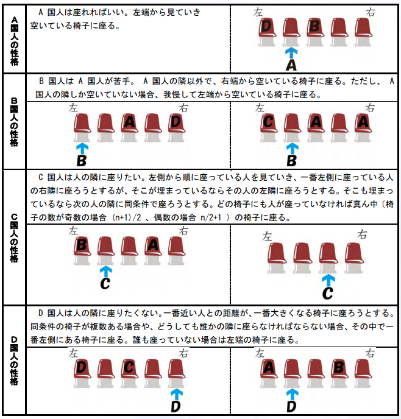

# 難儀な人たちが座る椅子

難易度:★★★★

## 問題
４つの国の中心にある中立都市アイズシティには、大陸横断列車バンダイ号のホームがあります。  
ホームには、バンダイ号を待つ乗客用の椅子が一列に用意されており、ホームに入ってきた人は自由
に椅子を利用することができます。  
このバンダイ号、安いし早いし快適ということで、周囲の４つの国からの利用者が絶えません。今
日は開通記念日ということで、ホームに座っている人たちに特別なことをしてあげようと思っていま
す。そのためには、改札を通った人たちがどこに座っているか把握しなければなりません。４つの国
の人たちの難儀な性格を考慮して、椅子がどのように埋まっているかをシミュレートするプログラム
を作成してください。改札を通った人たちは、次々に一列に並んだ椅子に座っていきます。４つの国
の人たちは、国ごとに決まった性格と座り方があります。それぞれの座り方は以下の通りです。



バンダイ号に乗ろうとしている乗客の情報を入力とし、椅子にどのように座っているかを出力するプ
ログラムを作成してください。ただし、椅子の数は 1 以上 10000 以下とし、乗客の数は椅子の数を超
えることはありません。左から順番に座っている人の国籍を出力します。  
ただし、空席の場合は # (半角シャープ)を出力してください。
### 入力
複数のデータセットの並びが入力として与えられます。入力の終わりはゼロふたつの行で示されます。  
各データセットは以下のとおりです。  
1 行目 椅子の数 n 乗客の数 m （整数 整数；半角空白区切り）  
2 行目 1 人目の情報 a （半角文字）  
A ならば A 国人  
B ならば B 国人  
C ならば C 国人  
D ならば D 国人  
3 行目 2 人目の情報  
4 行目 3 人目の情報  
 ：  
m+1 行目 m 人目の情報

### 出力
入力データセットごとに、最終的な椅子の状態を出力します。
### 入力例
```
5 4
A
B
C
D
5 4
D
C
B
A
0 0
```


### 出力例
```
ACD#B
DCA#B
