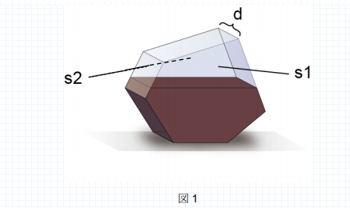
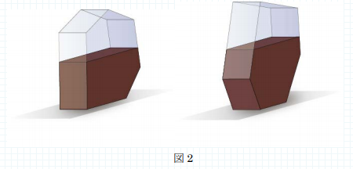

# アリの巣箱の形状

難易度:★★★★

## 問題
求悟君は夏休みの自由研究としてアリの巣の観察を行うことにしました。彼のおじいちゃんが孫のために用意してくれた観察用の透明ケースはとてもユニークで、図 1 のような形をしています。


このケースは、2 枚の合同な凸多角形 s1、s2 と何枚かの長方形で構成されています。s1、s2 以外のいずれかの長方形の面を床に接するように置きます。観察を始めた求悟君は、入っている土の量が同じにもかかわらず、底面の選び方によって土の高さが変わることに気付きました（図 2）。



求悟君は、ケースの置き方によって、どのくらい高くなるか知りたくなりました。凸多角形 s1 の形、s1 とs2 間の距離 d、土の体積 V を入力とし、土の高さの最大値を出力するプログラムを作成してください。ただし、ケースに入れる土の粘性は水のように低く、底面を床に置くとすぐに水平になるものとします。  
透明ケースのs1 の形は、二次元の座標平面上の n 個の頂点で与えられます。これらの頂点は、反時計回りの順番で入力されます。n は 3 以上 100 以下で、d と V はそれぞれ 1 以上 10000 以下の整数とします。また多角形の頂点の座標(x,y)の x、y はそれぞれ-1000 以上 1000 以下の整数とします。土の高さの最大値は小数点以下第 7 位を四捨五入して、小数点第 6 位まで出力してください。


### 入力

複数のデータセットの並びが入力として与えられます。入力の終わりはゼロ3つの行で示されます。  
各データセットは以下のとおりです。  
1 行目 n d V（整数 整数 整数；半角空白区切り）  
2 行目 第 1 の頂点の座標 x y（整数 整数；半角空白区切り）  
3 行目 第 2 の頂点の座標  
：  
n+1 行目 第 n の頂点の座標

### 出力
入力データセットごとに、土の高さの最大値を出力します。

### 入力例
```
4 1 1
0 0
1 0
1 2
0 2
0 0 0
```


### 出力例
```
1.000000
