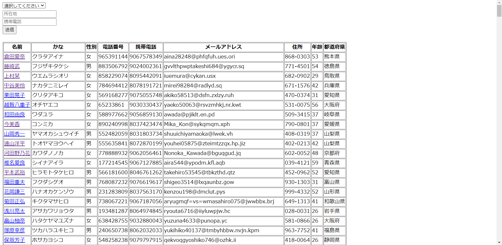
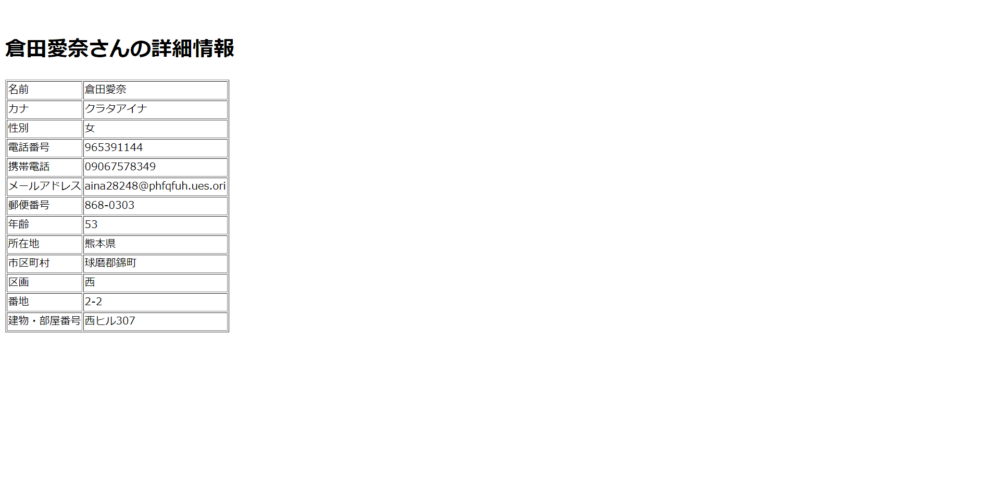

# 顧客詳細ページ

顧客の詳細情報を表示するページを追加しましょう。  

## 仕様 
- 顧客名をクリックすると、クリックした顧客の詳細情報を表示する。




## 注意点

```
<input type="submit">
```
を使わず、aタグでリクエストを送ります。そのため、強制的にgetリクエストになります。  
ここで、aタグのhref属性について注意点があります。リンクをフルパスで書かなければいけないことです。  
※フルパス=ブラウザで上部に書かれているパス。ここではlocalhost~の部分  

http://localhost:8080/{プロジェクト名}/  
と書いてもよいですが、以下でプロジェクト名までのパスを取得できます。

```
request.getContextPath()
```