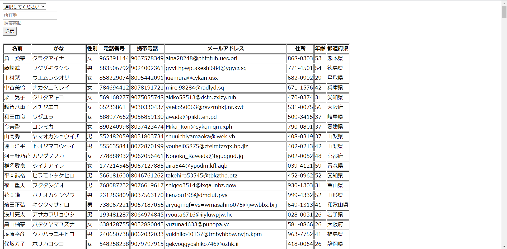

# ソート・フィルタ機能の追加

顧客リスト表示ページに、ソート機能とフィルタ機能を追加しましょう。  

## ソート機能
年齢（昇順・降順両方）でのソート。
セレクトボックスに「年齢降順」「年齢昇順」の項目があり、どちらかを選んだ状態でサブミットボタンを押すとソートされる。  

## フィルタ機能
- 所在地によるフィルタ。テキストボックスで文字を入力し、stateカラムにその文字列を含む顧客のみ表示する。
- 電話番号によるフィルタ。mobileカラムがテキストボックスで入力した番号で始まる顧客のみ表示する。

## 注意点
ソート機能とフィルタ機能は重複して機能する。  
例えば、「年齢昇順」「080」を選択してサブミットボタンを押すと、「080で始まる電話番号の顧客」が「年齢昇順」で表示される。

