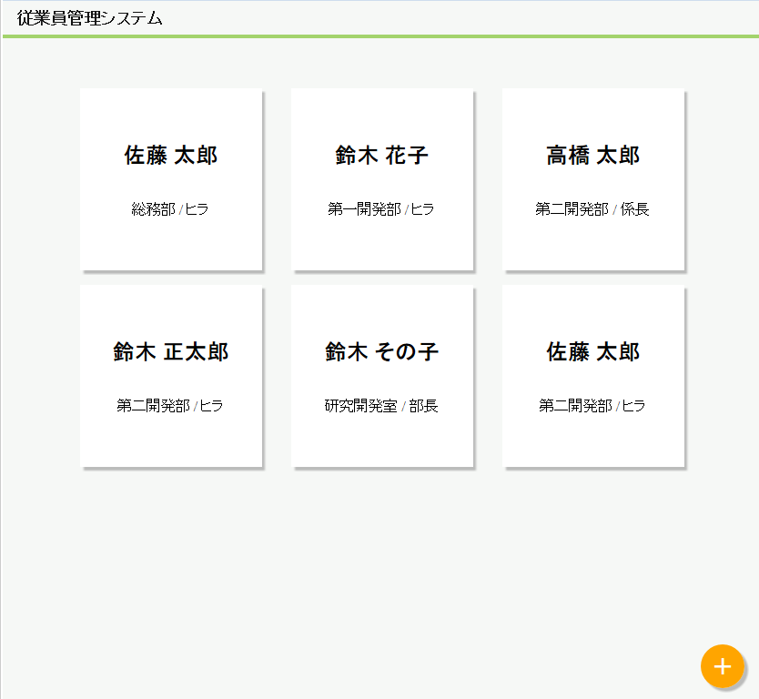

# 従業員の一覧を表示する

ページにアクセスし、従業員の一覧を表示してください。

なお、従業員は以下のように表示を行うようにしてください。

モックとして、ベースとなるHTMLとCSSは以下のファイルを使用することとし、  
これらのファイルをベースにjspを作成してください。

- [モックのHTML](./list.html)
- [使用するCSS](./style.css)

※右クリックでファイルをダウンロードできます。