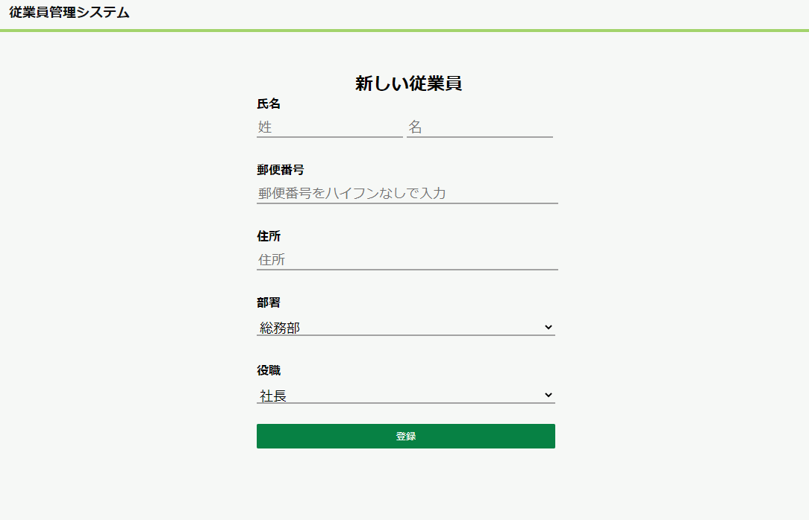

# 新規画面を作成する

新しく従業員を作成するプログラムを作成してください。

## 一覧画面の変更

なお、一覧からは右下の＋ボタンから遷移するようにしてください。

## 新規画面の作成

以下の画面イメージを元に、新規で従業員を登録する画面を作成して下さい。

なお、作成には以下のモックを使用してください。
(CSSは他のページと同じものを使用します。)

- [モックのHTML](./new.html)

※右クリックでファイルをダウンロードできます。

## 処理概要

### 初期表示時

データベースより、部署情報と役職情報をそれぞれ取得する。

表示時に、部署および役職のドロップダウンリストにそれぞれの内容を表示してください。

### 「登録」ボタン押下時

入力した内容をもとにデータベースに登録を行ってください。

なお、登録後は一覧画面に遷移してください。