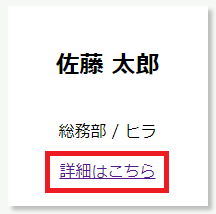
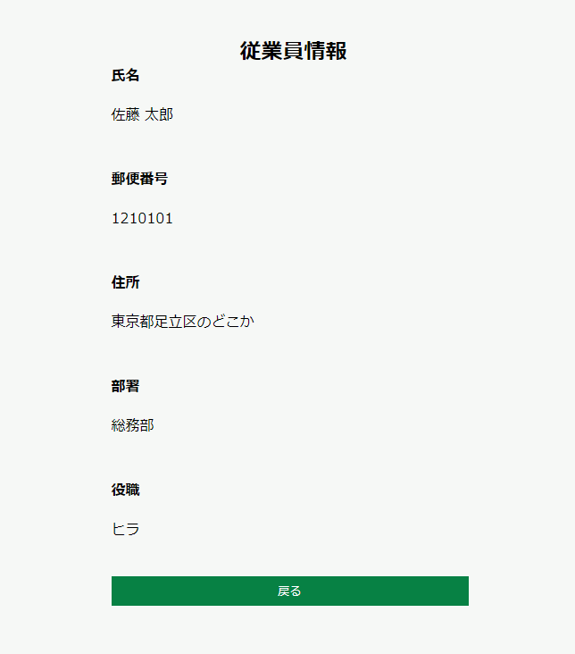

# 詳細画面を作る

従業員の情報を表示する詳細画面を作成します。

## 一覧画面を変更

以下のように、一覧画面の各カードに対してリンクを作成します。

## 詳細画面の作成

以下の画面イメージを参考にし、詳細画面を作成してください。

なお、基本的な構造やCSSは新規画面のレイアウトを一部変更して作成してください。  

新規画面のinput要素やselect要素をpタグに変更することで、
簡単に作成することができます。

